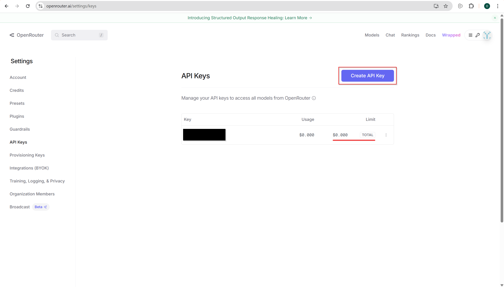

# jobs-are-the-way

## Virtual Environment Set-up

For windows, create a VE using:

```powershell
python -m venv .venv
```

and activate by running:

```powershell
venv/scripts/activate
```

Alternatively, if you have installed `make` previously, you can simply run the make command:

```powershell
make virtual-environment
```

## Environmental Variables

Simply copy over the required environmental variables by running:

```powershell
cp .env.example .env
```

For instructions on how to get an OpenRouter API Key, please refer to the [OpenRouter API Key](#openrouter-api-key) section.

## OpenRouter API Key

To support our workflow, we will require the use of LLMs.
As OpenRouter supports the usage of free models from various providers, we will use it as our LLM provider.

To get the API Key, we can simply get it by logging into OpenRouter using a GitHub/Google account (or creating your own account), and heading over to https://openrouter.ai/settings/keys to create an API Key by clicking on the `Create API Key` button, as shown below:


