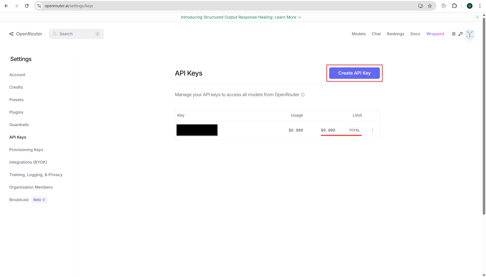

# jobs-are-the-way

Automates scraping job postings and posting them to dedicated Telegram threads (channels).

## Table of Contents

1. [Project Overview](#project-overview)
2. [Prerequisites](#prerequisites)
3. [Setup](#setup)
4. [Environment Variables](#environment-variables)
5. [Running the Workflow](#running-the-workflow)
6. [Development](#development)
7. [Further Docs](#further-docs)

## Project Overview

The project scrapes job listings, classifies each job into a category (e.g. Software
Engineer, Data Engineer) using an LLM, and posts them into the matching Telegram thread.

- **Job source:** JobSpy (scraping) — see `src/`
- **Classification:** LLM via OpenRouter and/or HuggingFace
- **Delivery:** Telegram Bot API, posting per category thread
- **Storage:** PostgreSQL, with Alembic migrations
- **Scheduling:** GitHub Actions hourly / daily workflows

## Prerequisites

- Python 3.13+
- [uv](https://docs.astral.sh/uv/) (recommended for environment + dependency management)
- Docker (only if you want to run PostgreSQL locally — see the database note in [Environment Variables](#environment-variables))
- A Telegram Bot token + channel, meeting the environment variables below

## Setup

Create a virtual environment (Windows PowerShell):

```powershell
python -m venv .venv
```

or with uv:

```powershell
uv venv
```

Activate it:

```powershell
.venv/Scripts/activate
```

Sync dependencies:

```
uv sync --all-extras
```

## Environment Variables

Copy the example file to create your local environment file:

```powershell
cp .env.example .env
```

Then fill in the values. For instructions on getting each key, see the
[OpenRouter API Key](#openrouter-api-key) section.

> The repository also has optional PostgreSQL storage. If you use it, start a local
> instance with `make db` (Docker) and open a psql console with `make db-it` — these
> require `POSTGRES_DB`, `POSTGRES_USER`, and `POSTGRES_PASSWORD` to be set.

### OpenRouter API Key

To support our workflow, we use LLMs to classify jobs. OpenRouter lets us use free models
from various providers, so we use it as our LLM provider.

To get an API Key:
1. Log into [OpenRouter](https://openrouter.ai/) using a GitHub/Google account (or create one).
2. Go to https://openrouter.ai/settings/keys.
3. Click the `Create API Key` button and copy the key.



## Running the Workflow

Run migrations and the main job-sending workflow with:

```
pymake run
```

This runs `alembic upgrade head`, then executes `src.main`.

## Development

To install the pre-commit hooks (ruff lint + format checks):

```bash
pre-commit install
```

Format and lint the code:

```bash
uv run ruff format src/
uv run ruff check src/
```

## Further docs

- [Adding a New Job Channel](docs/ADD_NEW_JOB_CHANNEL.md)
